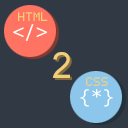
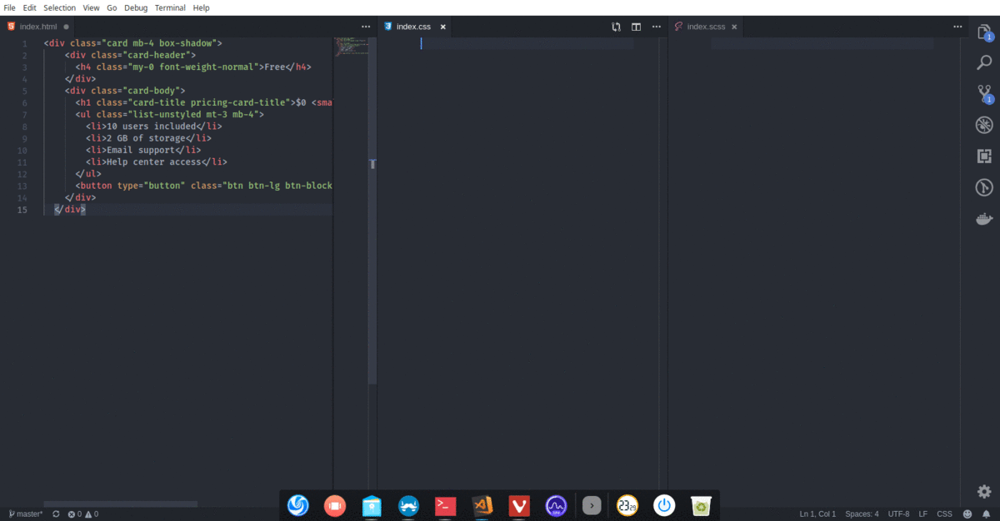

  

  
  
  
  
  

## Table of content
- [About](#about)
- [Preview](#preview)
- [Usage](#usage)
- [Installation](#installation)
- [License](#license)
- [Changelog](CHANGELOG.md)

## About
Visual Studio Code extension enables developers to convert Html code structure to Css/Less/Sass selectors!

Please see preview & usage for more information.

## Preview

## Usage

Default usage:

1. Copy valid Html code (including closing tags)
2. Paste the code using key combination `CMD+ALT+V`
3. It will paste CSS selectors to *.css files and Sass/Less selectors to all other files.

Alternative usage:
1. Open command pallete by clicking `CTRL+SHIFT+P`
2. Type `Convert Html to Css` and select suggested option

## Installation

Via Quick Open:

1. [Download](https://code.visualstudio.com/download), install and open VS Code
2. Press `CMD+P` to open the Quick Open dialog
3. Type `ext install html-to-css`
4. Click the *Install* button, then the *Enable* button

Via the Extensions tab:

1. Click the extensions tab or press `CMD+SHIFT+X`
2. Search for *html to css*
3. Click the *Install* button, then the *Enable* button

Via the command line:

1. Open a command-line prompt
2. Run `code --install-extension TautvydasDerzinskas.vscode-html-to-css`

## License
The repository code is open-sourced software licensed under the [MIT license](https://github.com/SlimDogs/make-youtube-great-again/blob/master/LICENSE?raw=true).